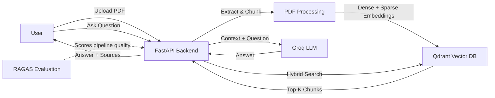

# InsightRAG

A Retrieval-Augmented Generation (RAG) pipeline that lets you upload PDF documents and ask questions about them — with hybrid search, automated quality evaluation, and a fully containerized deployment.

## Features

- **Multi-PDF upload** — upload one or more PDFs; documents are combined into a single searchable knowledge base (no data loss on new uploads)
- **Hybrid search** — combines dense (semantic) and sparse (keyword/BM25) retrieval via Qdrant's RRF fusion for better accuracy
- **Confidence-gated answers** — if retrieval confidence is below a threshold, the system honestly says "not found" instead of hallucinating
- **Automated evaluation (RAGAS)** — faithfulness, answer relevancy, context precision, and context recall are measured against a 20-question test set
- **Groq-powered generation** — fast, free-tier LLM inference for answering questions
- **Fully containerized** — Docker + Docker Compose for one-command deployment, no local Python/Ollama setup needed
- **Simple chat UI** — upload PDFs and ask unlimited questions from a clean web interface
## Architecture


## Tech Stack

| Component | Technology |
|---|---|
| Backend API | FastAPI |
| Vector Database | Qdrant (hybrid dense + sparse search) |
| Dense Embeddings | fastembed (BAAI/bge-small-en-v1.5) |
| Sparse Embeddings | fastembed (BM25) |
| LLM (Generation) | Groq (openai/gpt-oss-120b) |
| Evaluation | RAGAS + Groq (judge LLM) |
| Deployment | Docker + Docker Compose |
| Frontend | HTML/JS (vanilla) |

## Evaluation Results

Automated evaluation using RAGAS on a 10-question test set (Attention Is All You Need paper):

| Metric | Score |
|---|---|
| Faithfulness | 0.82 |
| Answer Relevancy | 0.87 |
| Context Precision | 0.79 |
| Context Recall | 1.00 |

Full per-question results are available in [`eval_results.csv`](eval_results.csv).

During development, this evaluation pipeline caught real issues — including a case where the generation model added unsupported claims ("based on general knowledge") despite explicit instructions not to. This was fixed by tightening the prompt and re-running evaluation, demonstrating the pipeline's diagnostic value beyond just producing a score.
## Screenshots

**Chat interface with live evaluation stats**


**PDF upload confirmation**


**Question answering with source attribution**


**Docker deployment running**


## Setup Instructions

### Option 1: Run with Docker (recommended)

No Python setup needed — everything runs in containers.

1. Clone the repository:

git clone https://github.com/HarshVarshney0001/InsightRAG.git
cd InsightRAG

2. Create a `.env` file in the project root with your Groq API key:

GROQ_API_KEY=your_key_here

(Get a free key at [console.groq.com](https://console.groq.com))

3. Run:

docker-compose up --build

4. Open your browser at `http://localhost:8000/`

5. Upload a PDF and start asking questions.

### Option 2: Run locally (without Docker)

1. Install dependencies:

pip install -r requirements.txt

2. Make sure Qdrant is running locally (via Docker or standalone):

docker run -p 6333:6333 qdrant/qdrant

3. Add your Groq API key to a `.env` file (see above).

4. Run the API:

uvicorn api:app --reload

5. Open your browser at `http://localhost:8000/`

### Running the Evaluation Script

python eval.py

This evaluates the pipeline against a 20-question test set and saves results to `eval_results.csv`.

## Project Structure
```
InsightRAG/
├── main.py              — Core RAG pipeline: PDF loading, chunking, embeddings, retrieval, generation
├── api.py               — FastAPI backend: /upload, /ask, /eval-stats endpoints
├── eval.py              — RAGAS-based automated evaluation script
├── static/
│   └── index.html       — Chat UI (upload + Q&A interface)
├── data/                — Sample PDF for testing
├── screenshots/         — README screenshots
├── eval_results.csv     — Saved evaluation scores
├── Dockerfile
├── docker-compose.yml
├── requirements.txt
└── README.md
```
